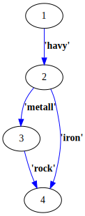
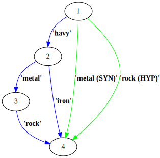

# Linguistic expansion stage

The logic implementation for
[Semantic Graph Linguistic expansion Stage](../javascript/SemanticGraphLinguistic.js).
On this stage we get tokens from edges and for each looking for synonyms and adding then in parallel edges.

## Deployment
1. Create a new _Collection_ in your Fusion application. It should follow
   the requirements as below:
   * Name pattern is `<application name>_synonym`
   * Should be placed in the same Solr cluster

2. Collection of synonyms and hyponyms/hypernyms for linguistic expansion have the following format:

   |source_word|synonym_word|linguistic_type|
   |-----------|------------|---------------|
   |white      |colourless  |SYN            |
   |red        |ruby        |SYN            |

   where 
   1. __source_word__ - asked word
   2. __destination_word__ - synonym or hypernym
   3. __linguistic_type__ - relation between `source_word` and `destination_word`. 
   Can take __SYN__ or __HYP__ values.
   
3. Fields __source_word__, __destination_word__, __linguistic_type__ should be 
   defined in Solr _managed-schema_ (or _schema.xml_) file like __text_general__
   in the synonym collection:
   
   ```
   <field name="linguistic_type" type="text_general" indexed="true" stored="true"/>
   <field name="source_word" type="text_general" indexed="true" stored="true"/>
   <field name="synonym_word" type="text_general" indexed="true" stored="true"/>
   <field name="signatureField" type="string" uninvertible="true" indexed="true" stored="true"/>
   ```
   
4. Add next chain to the solrconfig.xml in the synonym collection
   ```
   <updateRequestProcessorChain name="syndedupe">
       <processor class="solr.UUIDUpdateProcessorFactory"/>
       <processor class="solr.DistributedUpdateProcessorFactory"/>
       <processor class="solr.processor.SignatureUpdateProcessorFactory">
           <bool name="enabled">true</bool>
           <str name="signatureField">signatureField</str>
           <bool name="overwriteDupes">true</bool>
           <str name="fields">source_word,synonym_word,linguistic_type</str>
           <str name="signatureClass">solr.processor.Lookup3Signature</str>
       </processor>
       <processor class="solr.LogUpdateProcessorFactory"/>
       <processor class="solr.RunUpdateProcessorFactory"/>
   </updateRequestProcessorChain>
   ```
   
5. The definition of the request handler should be added to _solrconfig.xml_ in the product collection:
   ```
   <!-- A request handler for the linguistic query stage  -->
   <requestHandler name="/linguisticRH" class="com.lucidworks.fusion.semanticsearch.query.LinguisticStageRequestHandler"/>
   ```

6. Index synonyms, e.g. using [demo-synonym.csv](demo-synonym.csv).

7. Now have added complex synonym detection. For example if your graph has edges "havy", "metal" and "rock", and this edges 
   create one path, and your synonym collection has synonym "havy metal rock -> metal(SYN)", 
   this handler will add new edge with token "metal" and it will connect source vertex of "havy" and target vertex of "rock".
       
